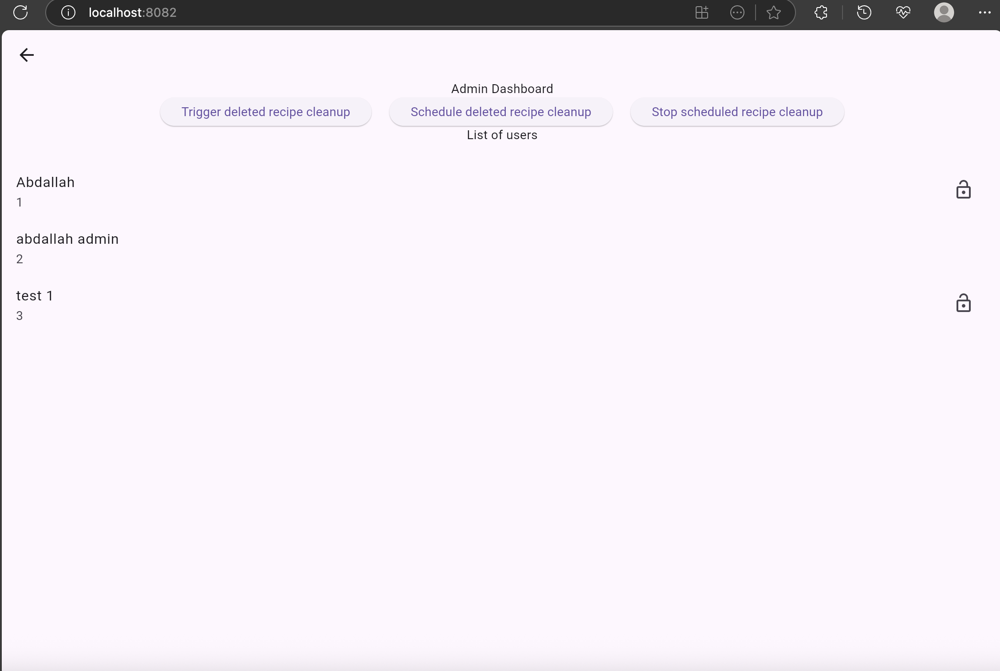

# 🧙‍♂️ Magic Recipe

A Flutter web application that generates AI-powered recipes based on ingredients provided by users through text input or image upload, built with Serverpod for backend services.

## Overview

Magic Recipe is a practice project designed to explore Serverpod development capabilities. Users can input ingredients they have available (either by typing or uploading an image), and the application uses Gemini AI to generate creative recipes using those ingredients. The app also maintains a history of previously generated recipes for easy reference.

## 🎯 Purpose

This project was created as a learning exercise to practice full-stack development using Serverpod, covering essential backend concepts from basic setup to advanced features like authentication, caching, and file uploads.

## 🧠 What I Learned

Through building this project, I gained hands-on experience with:

- **Serverpod Fundamentals**: Creating a Serverpod project from scratch and understanding its architecture
- **Data Management**: Working with Serverpod models and storing them in database tables
- **API Development**: Creating and testing custom endpoints
- **Authentication & Authorization**: Implementing user authentication and admin scopes
- **Advanced Features**:
  - Future calls for scheduling tasks
  - Caching mechanisms for improved performance
  - File upload functionality
  - Stream endpoints for real-time communication
- **Deployment**: Hosting a Flutter web application

## Key Features

- **User Authentication**: Secure login system
- **AI Recipe Generation**: Leverage Gemini AI to create recipes from available ingredients
- **Recipe History**: View and manage previously generated recipes with their ingredients
- **Multi-input Support**: Accept ingredients via text input or image upload
- **Responsive Design**: Optimized for web browsers

## Screenshots

### First screen


### Login


### Register


### Example recipes


### Admin dashboard



## Technologies Used

### Core Framework

- **Serverpod**: 2.7.0
- **Flutter**: 3.29.1

### Server Dependencies

- `google_generative_ai: ^0.4.7` - Integration with Gemini AI
- `meta: ^1.17.0` - Dart metadata annotations
- `serverpod_auth_server: 2.7.0` - Server-side authentication

### Client Dependencies

- `serverpod_auth_client: 2.7.0` - Client-side authentication

### Flutter App Dependencies

- `serverpod_auth_shared_flutter: 2.7.0` - Shared authentication components
- `serverpod_auth_email_flutter: 2.7.0` - Email authentication for Flutter
- `image_picker: ^1.1.2` - Image selection functionality

## ⚙️ Prerequisites

Before running this project, ensure you have the following installed:

### 1. Flutter SDK

Install Flutter following the [official documentation](https://flutter.dev/docs/get-started/install)

### 2. Docker Desktop

Install Docker Desktop from [https://docs.docker.com/desktop/](https://docs.docker.com/desktop/)

> **Important**: Make sure Docker Desktop is running while using Serverpod

### 3. Serverpod CLI

```bash
dart pub global activate serverpod_cli
```

Verify installation:

```bash
serverpod
```

### 4. Development Tools

Install the **[Serverpod VS Code extension](https://marketplace.visualstudio.com/items?itemName=serverpod.serverpod)** for enhanced development experience

## Getting Started

Follow these steps to run the project locally:

### 1. Clone and Open Project

```bash
git clone [your-repo-url]
cd magic_recipe
```

### 2. Start Database Services

Navigate to the server directory and start Docker services:

```bash
cd magic_recipe_server
docker compose up -d
```

> Ensure Docker Desktop is running before executing this command

### 3. Generate Serverpod Code

```bash
serverpod generate
```

### 4. Apply Database Migrations

```bash
dart run bin/main.dart --apply-migrations
```

### 5. Access the Application

Open your browser and navigate to:

```
http://localhost:8082
```

## Project Structure

```
magic_recipe/
├── magic_recipe_server/     # Serverpod backend
├── magic_recipe_client/     # Generated client code
├── magic_recipe_flutter/    # Flutter web application
└── scripts/                 # To run Host flutter web app script
```

## Contributing

This project was created as a learning exercise following a Serverpod course. Feel free to explore the code and use it as a reference for your own Serverpod projects.

## License

This project is for educational purposes and was created as part of a Serverpod development course.
